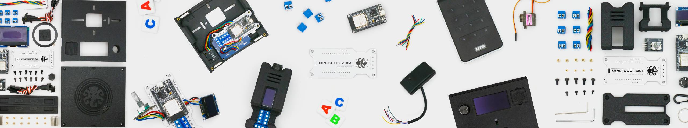

# The OpenDoorSim Project

OpenDoorSim is an **open-source PACS / RFID lab** you can **build yourself!** OpenDoorSim simulates Physical Access Control Systems (PACS) just like the real world - and makes running everything from home experiments to big CTFs and demos a breeze. Sporting a **fresh web UI**, an **on-device hardware menu**, turnkey **tamper detection**, and easy **batch user management**, you may find it hard to put down... 

You can either buy the parts yourself and build at home, or order an easy-build kit from [shortrange.tech](https://shortrange.tech) if you want to support the project. 🐙❤️ Kits come with a microcontroller, all the parts you need to build, a quality, weather-resistant 3D printed ASA case... and of course the feel-good fuzzies you get for supporting the project.

Thank you for supporting **OpenDoorSim**, which is based on the excellent work of many RF greats like evildaemond, nechry, iceman, bettse, and others - this project wouldn't exist without them. Please check out the [acknowledgements](#Acknowledgments) section!

## Features

- Designed for students, hobbyists, and industry professionals
- Portable, easy to use and wire
- Can be built entirely with off-the-shelf parts (Tarrif-ic Model)
- Compatible with any wiegand reader!
- USB-C Powered
- Beautiful Web UI, manage CTFs and card data with ease
- Hardware Menu (run it offline!)
- Multiple Modes for various use cases (Raw, CTF, Wifi, Tamper Detect, etc)
- Rugged 3D printed cases!
- Compatible with various screens (LCD, OLED)
- Tamper Detection (for supported readers)
- Batch User Management
- Knob. <3
## OpenDoorSim Model Comparison

| **Model**                 | **LAB**    | **Pocket** | **Tarrif-ic** |
| ------------------------- | ---------- | ---------- | ------------- |
| Microcontroller           | ESP-32     | ESP-32     | ESP-32        |
| Firmware                  | Latest     | Latest     | Latest        |
| Screen Size               | 2.42" OLED | 0.96" OLED | Any           |
| Custom PCB                | ✅          | ✅          | ❌             |
| Case                      | ✅          | ✅          | ❌             |
| Wiegand Reader Compatible | ✅          | ✅          | ✅             |
| Hardware Menu             | ✅          | ✅          | ✅             |
| Wi-Fi Enabled             | ✅          | ✅          | ✅             |
| Custom GPIO Terminals (4) | ✅          | ✅          | ✅             |
| Fixed Reader Mount        | ✅          | ❌          | ❌             |
| Custom Module Slots       | ✅          | ❌          | ❌             |
| MagSafe Compatible Ring   | ✅          | ❌          | ❌             |
| Magnetic Decal Tile       | ✅          | ❌          | ❌             |
| Strap Loops               | ✅          | ❌          | ❌             |
| Keyring and Carabiner     | ❌          | ✅          | ❌             |
## Getting Started:

### How to Build your OpenDoorSim:
Building an OpenDoorSim is as easy as 1-2-3:
1. Gather the required materials and tools for your build.
	1. Material and Tool BOMs (Bill of Materials) can be found in the.
	2. 
2. Follow the 3-part build guide (Build, Assemble, Flash!) for the model you want to build.
3. Learn how to use it!

### How to Build your OpenDoorSim:
Building an OpenDoorSim is as easy as 1-2-3:  
1. Gather the required materials (order yourself or support the project by [buying a kit from my website](https://shortrange.tech), which includes everything but the reader).  
2. Build by following the [pdf guide](#build-your-opendoorsim) or this [step-by-step video](https://shortrange.tech).  
3. Flash the microcontroller by following the [pdf guide](#flash-your-opendoorsim) or this [step-by-step video](https://shortrange.tech).  
	
### Materials and Tools Needed (Bill of Materials):
[TODO: All materials image here]  
All components necessary to build a doorsim are found below, and (besides the reader) are included in the [official kit](https://shortrange.tech). 

`Disclaimer: All Amazon links below are affiliate links. If you purchase within 24hrs of clicking I may recieve a small commission, which helps support the OpenDoorSim project. Thank you!`

#### Components

| Components                                                                                                                           | Quantity | Link / Notes                                                                                                                                                                                                                                                                                       |
| ------------------------------------------------------------------------------------------------------------------------------------ | -------- | -------------------------------------------------------------------------------------------------------------------------------------------------------------------------------------------------------------------------------------------------------------------------------------------------- |
| ESP-32 WROOM 30 pin ESP-WROOM-32 Type C                                                                                              | 1        | 3-Pack [Amazon](https://www.amazon.com/AITRIP-ESP-WROOM-32-Development-Microcontroller-Integrated/dp/B0CR5Y2JVD/ref=sr_1_3?tag=shortrange-20) 1-Pack [Amazon](https://www.amazon.com/AITRIP-ESP-WROOM-32-Development-Microcontroller-Integrated/dp/B0DF2YJSHN/ref=sr_1_3?tag=shortrange-20)  |
| Logic Level Converter Bi-Directional 3.3V-5V 4 Channel Shifter                                                                       | 1        | [Amazon](https://www.amazon.com/HiLetgo-Channels-Converter-Bi-Directional-3-3V-5V/dp/B07F7W91LC/ref=sr_1_3?tag=shortrange-20)                                                                                                                                                                      |
| Solderable Breadboard / PCB Prototype Board Double Sided 88.9mm x 52.1mm such as ElectroCookie                                       | 1        | [Amazon](https://www.amazon.com/ElectroCookie-Solderable-Breadboard-Electronics-Gold-Plated/dp/B07ZYNWJ1S/ref=sr_1_8?tag=shortrange-20)                                                                                                                                                            |
| Screw Terminal Block 4P Blue                                                                                                         | 2        | [Amazon](https://www.amazon.com/Tugermoola-Terminal-Connector-Connectors-Terminals/dp/B0D1GSBQWF/ref=sr_1_7_sspa?tag=shortrange-20)                                                                                                                                                                |
| Display Screen (LED or OLED, with I2C module)                                                                                        | 1        | Choose any ONE (1) screen from the list below                                                                                                                                                                                                                                                      |
| Encoder Knob KY-040 360 Degree Rotary Encoder Module                                                                                 | 1        | 8-Pack [Amazon](https://www.amazon.com/WGCD-KY-040-Degree-Encoder-Arduino/dp/B07B68H6R8/ref=sr_1_1?tag=shortrange-20) 4-Pack [Amazon](https://www.amazon.com/JTAREA-KY-040-Encoder-Encoders-Modules/dp/B0D2TW63G1/ref=sr_1_6?tag=shortrange-20)                                              |
| 3D Printed Rugged ASA Case (optional, but recommended)                                                                               | (1)      | (Optional) Print yourself [link to hardware files here] or buy at [shortrange.tech](https://shortrange.tech)                                                                                                                                                                                                                     |
| Card Reader (any wiegand reader, with D0 and D1 wires. The reader you get depends on what kind of cards you want to read - LF or HF) | 1        | I usually get my HF readers on eBay. You can try your luck with cheap LF readers on amazon as well. Cheap LF Reader [Amazon](https://www.amazon.com/LBS-125Khz-Waterproof-Wiegand-Control/dp/B08F7PK1KN/ref=sr_1_3?tag=shortrange-20)                                                              |

#### Connections and Wire
  *Note: For modularity, use female DuPont connectors so you can easily swap components later. However, if you want a more permanent connection that won't loosen over time, desolder the header pins on the screen and encoder knob and wire them directly to the board. In this case, you wouldn't need to buy the dupont connectors. The [official kit](https://shortrange.tech) includes enough wire and connectors for either option.*

| Connections and Wire                                                        | Quantity | Link                                                                                                                                                                                                                                                                                                                          |
| --------------------------------------------------------------------------- | -------- | ----------------------------------------------------------------------------------------------------------------------------------------------------------------------------------------------------------------------------------------------------------------------------------------------------------------------------- |
| Female Jumper 2P Dupont (for Screen power, Knob Power, and screen I2C data) | 3        | 3-Pack (6 if cut in half) [Amazon](https://www.amazon.com/uxcell-Female-Jumper-2-54mm-Breadboard/dp/B07FM73YN9/ref=sr_1_8?tag=shortrange-20)                                                                                                                                                                                  |
| Female Jumper 3P Dupont (for knob data)                                     | 1        | 10-Pack (20 if cut in half) [Amazon](https://www.amazon.com/ZYAMY-Female-Connector-Multicolor-Breadboard/dp/B07777HDBT/ref=sr_1_2?tag=shortrange-20) 5-Pack (probably too short to cut in half) [Amazon](https://www.amazon.com/Uxcell-a14061000ux0605-Female-Jumper-Connector/dp/B00O9Y8HYO/ref=sr_1_4?tag=shortrange-20) |
| Solid-Core Colored Wire                                                     |          | I really like this wire pack: [Amazon](https://www.amazon.com/TUOFENG-Hookup-Wires-6-Different-Colored/dp/B07TX6BX47/ref=sr_1_6_pp?tag=shortrange-20)                                                                                                                                                                      |
| Solder                                                                      |          | [Amazon](https://www.amazon.com/YI-LIN-Electrical-Soldering-0-22lbs/dp/B08RHWJVDP/ref=sr_1_6_pp?tag=shortrange-20)                                                                                                                                                                                                            |

#### Screens
*Note: You only need ONE screen from the list below. They are in order of largest (easiest to read) to smallest. A 20x4 LCD is included in the [official kit](https://shortrange.tech).*

| Display Screens | Link                                                                                                                                                                                                                                                                          |
| --------------- | ----------------------------------------------------------------------------------------------------------------------------------------------------------------------------------------------------------------------------------------------------------------------------- |
| LCD 20x4        | 3-Pack [Amazon](https://www.amazon.com/Hosyond-Module-Display-Arduino-Raspberry/dp/B0C1G9GBRZ/ref=sr_1_1?tag=shortrange-20) 1-Pack [Amazon](https://www.amazon.com/GeeekPi-Interface-Adapter-Backlight-Raspberry/dp/B07QLRD3TM/ref=sr_1_3?tag=shortrange-20) |
| OLED 128x64     | 5-Pack [Amazon](https://www.amazon.com/Hosyond-Display-Self-Luminous-Compatible-Raspberry/dp/B0BFD4X6YV/ref=sr_1_3?tag=shortrange-20)                                                                                                                                  |
| OLED 128x32     | 5-Pack [Amazon](https://www.amazon.com/Teyleten-Robot-Display-SSD1306-Raspberry/dp/B08ZY4YBHL/ref=sr_1_4?tag=shortrange-20) 1-Pack [Amazon](https://www.amazon.com/HiLetgo-Serial-Display-SSD1306-Arduino/dp/B01N0KIVUX/ref=sr_1_7?tag=shortrange-20)        |

#### Tools
*Note: These are my personal toolkit favorites that I use **all the time** and recommend to everyone. I still suggest the optional items as they make life a lot easier.*

| Shortrange's Tools     | Link                                                                                                                                |
| ---------------------- | ----------------------------------------------------------------------------------------------------------------------------------- |
| Soldering Iron (I know there are cheaper ones out there... but I love this one)        | [Amazon](https://www.amazon.com/FNIRSI-Soldering-Temperature-Electronics-Precision/dp/B0DBLMH1HS/ref=sr_1_2_sspa?tag=shortrange-20) |
| Wire Stripper / Cutter | [Amazon](https://www.amazon.com/haisstronica-Stripper-Automatic-Crimping-Universal/dp/B0B2NWK1QX/ref=sr_1_1_sspa?tag=shortrange-20) |
| Helping Hands (optional)      | [Amazon](https://www.amazon.com/Helping-Soldering-Workshop-Non-slip-Weighted/dp/B07MDKXNPC/ref=sr_1_9?tag=shortrange-20)            |
| Parts Mat  (optional)            | [Amazon](https://www.amazon.com/Kaisi-Insulation-Soldering-Maintenance-Electronics/dp/B073RFB6BX/ref=sr_1_6?tag=shortrange-20)      |
| Small Screwdriver Set  | [Amazon](https://www.amazon.com/AXTH-Precision-Screwdriver-Professional-Electronic/dp/B0CBTYZY2S/ref=sr_1_6?tag=shortrange-20)      |

### Build your OpenDoorSim:
Because
### Flash your OpenDoorSim:

## How to Use your OpenDoorsim:
For the most comprehensive walkthrough, check out this ["Getting Started with the OpenDoorSim" video](https://shortrange.tech). If you prefer a quicker intro, give this [blog post](https://shortrange.tech) a try or continue reading below:
### Getting Started
### Web Interface
### Hardware Interface

## About the Kits
Kits available at [shortrange.tech](https://shortrange.tech) come with a pre-flashed microcontroller, all the materials needed to build your own OpenDoorSim, and a quality, weather-resistant 3D printed ASA case, plus some other goodies. Note that these kits are **BYOR (bring your own reader)**, that is, you will still need to **buy or bring your own reader if you buy a kit**! If you buy a kit, thank you for supporting the project!

You may be able to find all the materials yourself online for cheaper than the cost of buying a kit. If so, that's great - I'm all for minimizing cost to help more people get into the awesome world of RFID. However, if you're feeling the love, **a kit is a great way to support the OpenDoorSim project**. When you get kits directly from me at **[shortrange.tech](https://shortrange.tech)**, you are not just getting a sweet kit, but supporting me and the project - and for that I thank you!

## Support the Project
There are so many ways to support the project! Here are a few:
- Tell your friends about OpenDoorSim
- Buy an [official kit](https://shortrange.tech)
- Purchase from the Amazon links above
- Star the repository

## Licenses and Agreements

#### 

#### Amazon Links
I purchase many of my components and tools from Amazon, and to support my projects and research I have **affiliate linking.** This means if you click a link from me and check out within 24 hours, **I may make a small commission**. This is a great way to support my research and projects without purchasing anything directly from me. Amazon requires me to disclose this, and it is something I want to disclose anyways: As an Amazon Associate I earn from qualifying purchases.

#### GPLv3 License
This program is free software: you can freely use, modify, and distribute it. If you distribute your version, you must do so under the same GNU General Public License Version 3 (GPLv3) and include the source code. The software is provided without warranty, and the authors are not liable for damages.

## Acknowledgments
This project is largely based on and greatly inspired by evildaemond's [DoorSim project](https://github.com/evildaemond/doorsim), without which this project would likely not exist.

Thanks to nechry for his [PlatformIO refactoring fork](https://github.com/nechry/DoorSim) of evildaemond's original DoorSim project. It was a great base to work from and LittleFS as well as PlatformIO really saved the day on development.  

A big thank you to the incredible students, hackers, professionals, and mentors in Iceman's Discord community [RFID Hacking By Iceman](https://discord.gg/F6wwKj6BHr), and to Iceman for his support. You all inspire me.  

Thank you to all other open source creators and mentors who are doing inspiring work in the field of PACS / RFID! **Let's Hack The Planet!**  
