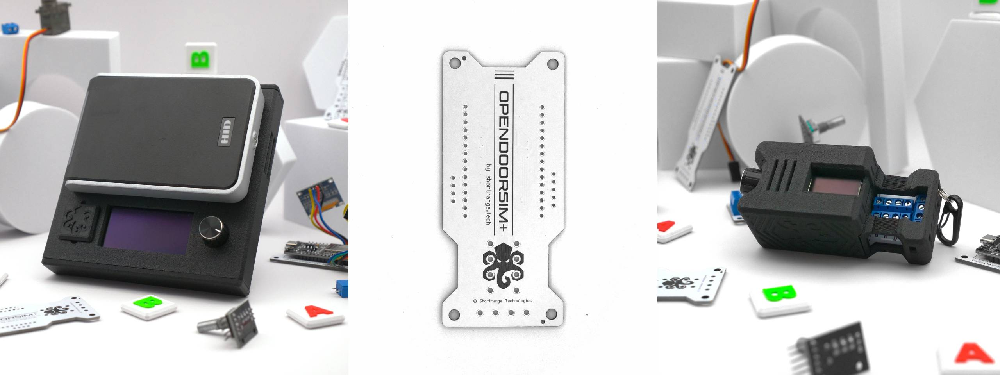

# The OpenDoorSim Project

> [!NOTE]
> 
> 🚧 README and Documentation are still under construction! Full documentation will be released incrementally as it becomes available! Check back soon for updates. 🚧

OpenDoorSim is an **open-source PACS / RFID lab** you can **build yourself!** OpenDoorSim simulates Physical Access Control Systems (PACS) just like the real world - and makes running everything from home experiments to big CTFs and demos a breeze. Sporting a **fresh web UI**, an **on-device hardware menu**, turnkey **tamper detection**, and easy **batch user management**, you may find it hard to put down... 

You can either buy the parts yourself and build at home, or order an easy-build kit from [shortrange.tech](https://shortrange.tech) as an extra way of supporting the project. 🐙❤️ Kits come with a microcontroller, all the parts you need to build, a quality, weather-resistant 3D printed ASA case... and of course the feel-good fuzzies you get for supporting the project. Read more about the kits [here](#about-the-kits).

Thank you for supporting **OpenDoorSim**, which is based on the excellent work of many RF greats like evildaemond,  iceman, bettse, nechry, and others - this project wouldn't exist without them. Please check out the [acknowledgements](#Acknowledgments) section!

---

## Features

- Designed for students, hobbyists, and industry professionals
- Portable, easy to use and wire
- Can be built entirely with off-the-shelf parts (Tarrif-ic Model)
- Compatible with any wiegand reader!
- USB-C Powered
- Beautiful Web UI, manage CTFs and card data with ease
- Hardware Menu (run it offline!)
- Multiple Modes for various use cases (Raw, CTF, Wifi, Tamper Detect, etc)
- Rugged 3D printed cases!
- Compatible with various screens (LCD, OLED)
- Tamper Detection (for supported readers)
- Batch User Management
- Knob. <3

---

## OpenDoorSim Model Comparison

| **Model**                 | **LAB**    | **Pocket** | **Tarrif-ic** |
| ------------------------- | ---------- | ---------- | ------------- |
| Microcontroller           | ESP-32     | ESP-32     | ESP-32        |
| Firmware                  | Latest     | Latest     | Latest        |
| Screen Size               | 2.42" OLED | 0.96" OLED | Any           |
| Custom PCB                | ✅          | ✅          | ❌             |
| Case                      | ✅          | ✅          | ❌             |
| Wiegand Reader Compatible | ✅          | ✅          | ✅             |
| Hardware Menu             | ✅          | ✅          | ✅             |
| Wi-Fi Enabled             | ✅          | ✅          | ✅             |
| Custom GPIO Terminals (4) | ✅          | ✅          | ✅             |
| Fixed Reader Mount        | ✅          | ❌          | ❌             |
| Custom Module Slots       | ✅          | ❌          | ❌             |
| MagSafe Compatible Ring   | ✅          | ❌          | ❌             |
| Magnetic Decal Tile       | ✅          | ❌          | ❌             |
| Strap Loops               | ✅          | ❌          | ❌             |
| Keyring and Carabiner     | ❌          | ✅          | ❌             |

---

## Getting Started:

### How to Build your OpenDoorSim:
Building an OpenDoorSim is as easy as 1-2-3:
1. Gather the required materials and tools for your build.
	1. Materials and Tool BOMs (Bill of Materials) can be found in the .
	2. Need tools? Here is my personal .
2. Follow the 3-part build guide (Build, Assemble, Flash!) for the model you want to build.
	1. BUILD GUIDES:
		1. LAB + Pocket Official Written Build Guide
		2. Tarrif-ic Written Build Guide
3. Learn how to use it!
	1. 🚧 Youtube Videos, How-To articles, etc. coming soon!

---
## Support the Project
There are so many ways to support the project! Here are a few:
- Tell your friends about OpenDoorSim!
- Use your OpenDoorSim!
- Get your own parts from the Amazon links above!
- Star the repository!
- Donate through the purchase of an [official kit](https://shortrange.tech).

## About the Kits
Kits come with a microcontroller, all the materials needed to build your own OpenDoorSim, and a rugged 3D printed ASA Carbon Fiber case. Because individual needs for readers vary, these kits are **BYOR (bring your own reader)**. That means if you want to use OpenDoorSim with a reader, you will need to **buy or bring your own reader**. If you buy a kit, thank you for supporting the project!

You may be able to find all the materials yourself and order the PCB online for cheaper than the cost of buying a kit. If so, sweet! The more people that can get into the awesome world of RF, the better. The goal of this project is to get a DoorSim into as many hands as possible, and there are many ways of supporting the project.

## Amazon Links
I purchase many of my components and tools from Amazon, and to support my projects and research I have **affiliate linking.** This means if you click a link from me and check out within 24 hours, **I may make a small commission**. As an Amazon Associate I earn from qualifying purchases like these. This is a great way to support my research and projects  without purchasing anything directly from me, and **at no extra cost to you!**. 

## Licenses and Agreements

This project is licensed under GPLv3.
#### GPLv3 License
This program is free software: you can freely use, modify, and distribute it. If you distribute your version, you must do so under the same GNU General Public License Version 3 (GPLv3) and include the source code. The software is provided without warranty, and the authors are not liable for damages.

See LICENSE.md for more details.

---
## Acknowledgments
This project is largely based on and greatly inspired by evildaemond's [DoorSim project](https://github.com/evildaemond/doorsim), without which this project would likely not exist, or at least have materialized nearly as soon as it did.

Thanks to nechry for his [PlatformIO refactoring fork](https://github.com/nechry/DoorSim) of evildaemond's original DoorSim project. It was a great base to work from and LittleFS as well as PlatformIO really saved the day on development.  

A big thank you to the incredible students, hackers, professionals, and mentors in Iceman's Discord community [RFID Hacking By Iceman](https://discord.gg/F6wwKj6BHr), and to Iceman for his support. You all inspire me.  

Thank you to all other open source creators and mentors who are doing inspiring work in the field of PACS / RFID / RF! **Let's Hack The Planet!**  
