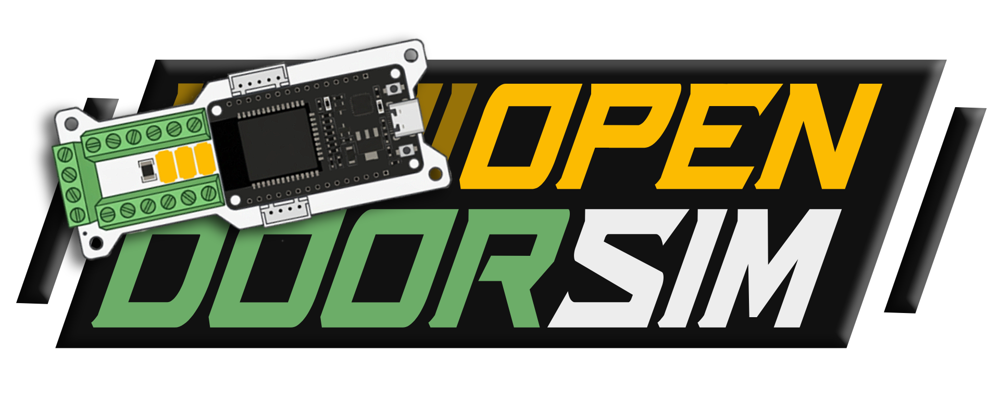

# OpenDoorSim — Personal RFID Lab

    

OpenDoorSim is your personal **open-source PACS / RFID lab!**. OpenDoorSim simulates Physical Access Control Systems (PACS) by connecting to real readers, so you can **hack the real thing!** At-home experiments, big CTFs, hands-on workshops, banger demos and advanced research are a breeze! It works with **any Wiegand or (soon) OSDP reader**, and fits easily in your bag. Sporting a **fresh web UI with a mirrored virtual display**, an **on-device hardware menu**, and multiple **modes** to make life easy, you may find it hard to put down... 

[Documentation](#) · [Build Guide](#) · [Firmware Guide](#) · [User Guide](#) · [Support the Project - Buy an Official Kit!](https://shortrange.tech) · [Self-Manufacture](#)

## Features

    

- Use any Wiegand or (soon) OSDP reader!
- Powered by 5V USB-C
- Beautiful Web UI for displaying data, managing users and modifying settings
- Handy on-device Menu for offline operations
- Multi Mode (Raw, User, Wifi, Stealth, Tamper Detect, etc)
- Live Virtual Display for easy demos
- Rugged 3D printed case
- Batch User Management

[ youtube video here ]

## Quick start

For starters -- you'll need at minimum an OpenDoorSim (ODS) Board and a reader. You can manufacture your own PCBs using the project files, or buy an official PCB completely assembled and pre-flashed at [shortrange.tech](https://shortrange.tech). The card reader is up to you -- buy one from ebay, borrow one from work, etc...

Once you have an ODS board and reader, plug the reader's data and power lines into the board, and then power it via 5V USB-C. Connect to the OpenDoorSim's Wifi SSID and navigate to 192.168.8.8 to interact with the web UI. Now, you're ready to begin scanning!

You may want to add a physical screen, knob, and protective case to physically interact with your OpenDoorSim beyond the web UI. Upgrades, people! Again, you can purchase / build these yourself using the project files and Bill of Materials, or buy as part of an official kit. 

Once you have the parts you need from the BOM, follow the official [build guide](#).

For full details on the project, please visit the [Official Documentation](#).

Finally, make sure to tell your friends about the project!

## Support the Project

There are so many ways to support the project! Here are a few:
- Tell your friends about OpenDoorSim!
- Use your OpenDoorSim!
- Get your parts from the official BOM!
- Star the repository!
- Buy an [official kit!](https://shortrange.tech).

## Licenses and Agreements

This project is licensed under GPLv3.

**GPLv3 License**
This program is free software: you can freely use, modify, and distribute it. If you distribute your version, you must do so under the same GNU General Public License Version 3 (GPLv3) and include the source code. The software is provided without warranty, and the authors are not liable for damages.

See [LICENSE](LICENSE) for more details.

## Acknowledgments

This project was initially based on and greatly inspired by evildaemond's [DoorSim project](https://github.com/evildaemond/doorsim), without which this project would likely not exist, or at least have materialized nearly as soon as it did. 

Thanks to nechry for his [PlatformIO refactoring fork](https://github.com/nechry/DoorSim) of evildaemond's original DoorSim project. It was a great base to work from and LittleFS as well as PlatformIO really saved the day on development.  

A big thank you to the incredible students, hackers, professionals, and mentors in Iceman's Discord community [RFID Hacking By Iceman](https://discord.gg/F6wwKj6BHr), and to Iceman for his support. You all inspire me.  

Thank you to all other open source creators and mentors who are doing inspiring work in the field of PACS / RFID / RF! **Let's Hack The Planet!**  
